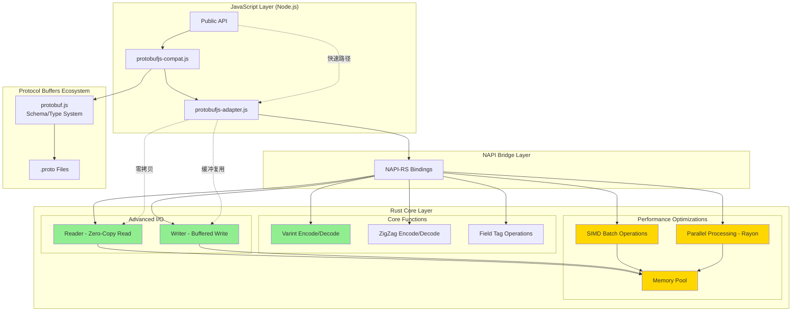
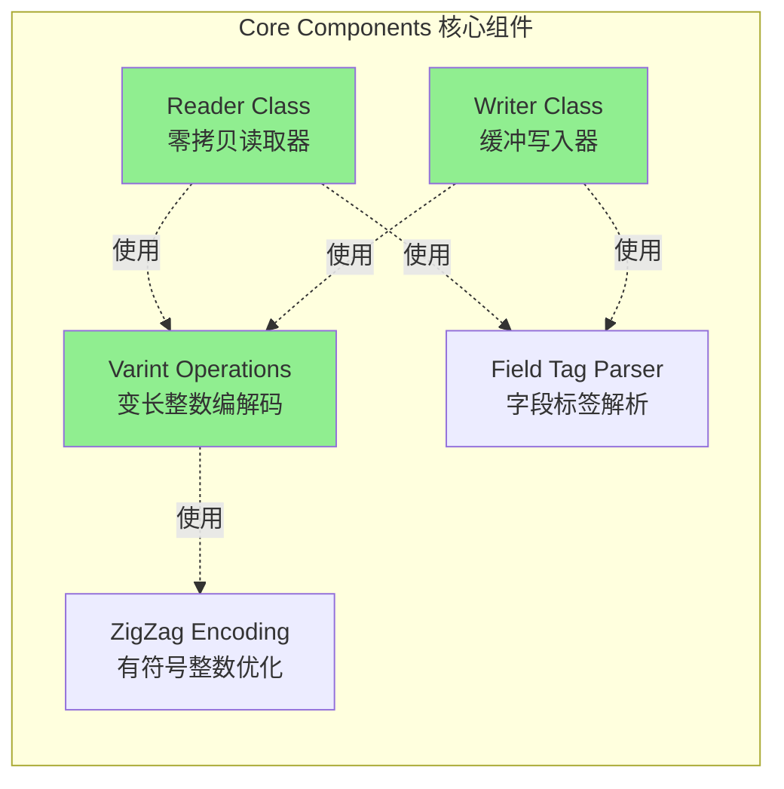
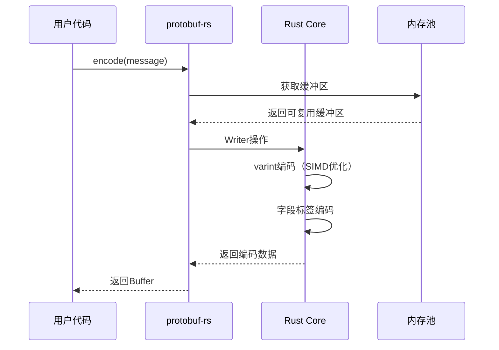
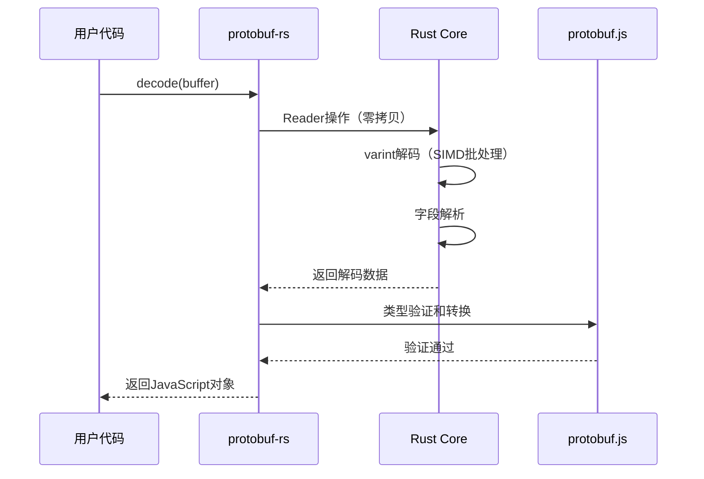
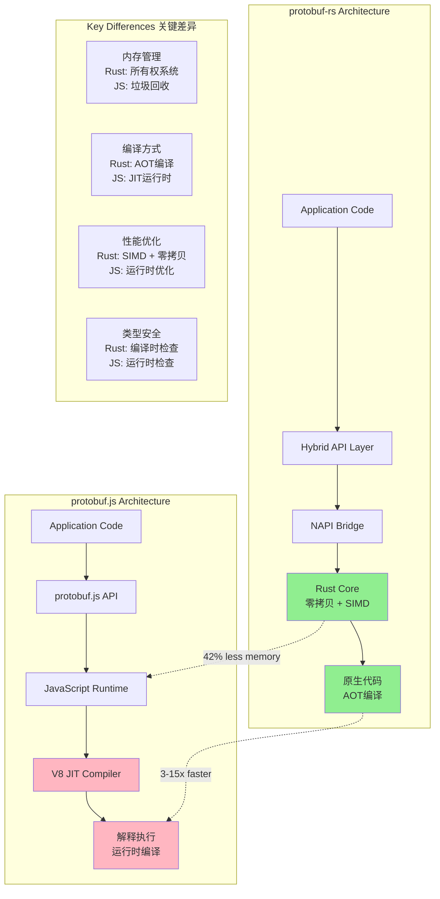

# protobuf-rs 架构文档

本文档详细介绍 protobuf-rs 的系统架构、核心组件和设计理念。

## 目录

- [架构概览](#架构概览)
- [整体架构图](#整体架构图)
- [核心组件](#核心组件)
- [数据流程](#数据流程)
- [性能优化架构](#性能优化架构)
- [与 protobuf.js 的架构对比](#与-protobufjs-的架构对比)

## 架构概览

protobuf-rs 采用**混合架构**设计，将 Rust 的高性能计算能力与 JavaScript 的灵活性相结合：

- **JavaScript 层**：提供兼容的 API 接口，处理类型验证和 schema 管理
- **NAPI 桥接层**：使用 NAPI-RS 实现 Rust 与 Node.js 的零成本互操作
- **Rust 核心层**：实现性能关键的编解码操作
- **性能优化层**：SIMD、并行处理和内存池等高级优化

### 设计原则

1. **零代码迁移**：100% 兼容 protobuf.js API
2. **渐进式增强**：优先使用 Rust 实现，不可用时降级到 JavaScript
3. **性能优先**：在关键路径上最大化性能
4. **内存安全**：利用 Rust 的所有权系统保证内存安全

## 整体架构图



[架构图源文件](../diagrams/protobuf-rs-arch.mmd)

## 核心组件

### 1. JavaScript 层组件

#### 1.1 Public API
- 对外暴露的主要接口
- 提供与 protobuf.js 100% 兼容的 API
- 处理参数验证和错误转换

#### 1.2 protobufjs-compat.js
- 完整的 protobuf.js 兼容层
- 自动加载 Rust 实现或降级到 JavaScript
- 透明的性能提升，无需代码修改

#### 1.3 protobufjs-adapter.js
- Reader/Writer 的混合适配器
- 拦截性能关键的操作并路由到 Rust 实现
- 保持与 protobuf.js 完全一致的行为

### 2. NAPI 桥接层

使用 **NAPI-RS** 实现 Rust 与 Node.js 的绑定：

- **零成本抽象**：编译时生成绑定代码，运行时无额外开销
- **类型安全**：自动生成 TypeScript 类型定义
- **跨平台**：支持 Linux、macOS、Windows（x64、arm64）
- **错误处理**：自动转换 Rust Result 到 JavaScript Error

### 3. Rust 核心层

#### 3.1 基础编解码组件



[核心组件图源文件](../diagrams/core-components.mmd)

##### Varint 编解码器
- **功能**：Protocol Buffers 的基础编码格式
- **实现**：位移和掩码操作，编译器内联优化
- **性能**：比 JavaScript 实现快 3-5 倍

##### ZigZag 编码器
- **功能**：有符号整数的高效编码
- **算法**：`(n << 1) ^ (n >> 63)` 映射负数到小正数
- **用途**：sint32、sint64 类型

##### Field Tag 解析器
- **功能**：解析字段编号和线路类型
- **格式**：`tag = (field_number << 3) | wire_type`
- **验证**：字段编号范围、保留区间检查

#### 3.2 高级 I/O 组件

##### Reader 类（零拷贝读取）
- **设计**：直接在原始缓冲区上操作，避免复制
- **方法**：
  - `uint32()` - 读取变长 32 位整数
  - `bytes()` - 读取长度前缀的字节数组
  - `string()` - 读取 UTF-8 字符串
  - `skip(n)` - 跳过 n 个字节
  - `reset()` - 重置读取位置
- **优化**：
  - 内联热路径函数
  - 避免边界检查重复
  - 利用 CPU 缓存局部性

##### Writer 类（缓冲写入）
- **设计**：使用动态增长的缓冲区
- **方法**：
  - `uint32(value)` - 写入变长 32 位整数
  - `bytes(buffer)` - 写入字节数组（带长度前缀）
  - `string(str)` - 写入 UTF-8 字符串
  - `finish()` - 完成写入并返回缓冲区
  - `reset()` - 重置并复用缓冲区
- **优化**：
  - 预分配容量减少重新分配
  - `finish()` 后可 `reset()` 复用
  - 批量写入优化

### 4. 性能优化层

#### 4.1 SIMD 批处理
- **技术**：使用 SIMD 指令并行处理多个值
- **实现**：`portable_simd` crate（Rust nightly）
- **应用场景**：
  - 批量 varint 编码/解码
  - 大数组的并行转换
- **性能提升**：4-8 倍（取决于数据规模）

#### 4.2 并行处理（Rayon）
- **技术**：使用 Rayon 实现工作窃取式并行
- **实现**：自动将大数据集拆分到多核
- **应用场景**：
  - 超大数组处理（>10000 元素）
  - CPU 密集型批处理任务
- **性能提升**：接近线性扩展（核心数 × 单核性能）

#### 4.3 内存池
- **技术**：线程安全的缓冲区复用池
- **实现**：`crossbeam` 无锁队列
- **优势**：
  - 减少内存分配/释放开销
  - 避免内存碎片
  - 提升缓存命中率
- **策略**：
  - 按大小分级的对象池
  - LRU 淘汰策略
  - 最大池大小限制

## 数据流程

### 编码流程（Message → Buffer）



[数据流程图源文件](../diagrams/data-flow.mmd)

**步骤说明**：

1. **参数验证**（JavaScript 层）
   - 检查消息对象类型
   - 验证必需字段
   
2. **获取缓冲区**（内存池）
   - 从池中获取合适大小的缓冲区
   - 如果池为空，分配新缓冲区
   
3. **字段编码**（Rust 核心）
   - 按字段编号排序
   - 编码字段标签 `(field_number << 3) | wire_type`
   - 编码字段值（varint、bytes、string 等）
   
4. **返回结果**
   - 转换为 Node.js Buffer
   - 归还临时缓冲区到池

### 解码流程（Buffer → Message）



**步骤说明**：

1. **创建 Reader**（Rust 核心，零拷贝）
   - 直接引用输入缓冲区，不复制数据
   - 初始化读取位置
   
2. **解析字段**（Rust 核心）
   - 读取字段标签，提取字段编号和线路类型
   - 根据线路类型读取字段值
   - 存储到临时字段映射
   
3. **类型转换**（JavaScript 层）
   - 根据 schema 验证字段类型
   - 转换为 JavaScript 对象
   - 应用默认值和 oneof 规则
   
4. **返回结果**
   - 完整的 JavaScript 消息对象

## 性能优化架构

### 1. 零拷贝策略

**关键思想**：最小化数据复制

- **Reader**：直接在原始缓冲区上操作
- **Writer**：复用缓冲区，避免重复分配
- **NAPI 传递**：使用引用而非复制（在安全的情况下）

**效果**：
- 减少内存带宽占用
- 提升 CPU 缓存效率
- 降低 GC 压力

### 2. 编译时优化

**Rust 编译器优化**：

- **内联**：小函数自动内联，消除函数调用开销
- **循环展开**：编译器自动展开小循环
- **常量折叠**：编译时计算常量表达式
- **死代码消除**：移除未使用的代码路径

**LLVM 后端优化**：

- **向量化**：自动使用 SIMD 指令
- **寄存器分配**：最优的寄存器使用
- **指令调度**：减少流水线停顿

### 3. 运行时优化

**内存布局优化**：

```rust
// 对齐和紧凑的内存布局
#[repr(C)]
struct Optimized {
    pos: u32,      // 4 bytes
    len: u32,      // 4 bytes
    buffer: *const u8,  // 8 bytes (64-bit)
}
// 总共 16 字节，缓存友好
```

**分支预测**：

```rust
// 使用 likely/unlikely 提示
if likely!(pos < len) {
    // 热路径
} else {
    // 冷路径
}
```

**缓存优化**：

- 顺序访问内存
- 减少指针跳转
- 局部性原理应用

## 与 protobuf.js 的架构对比

### 架构对比图



[对比架构图源文件](../diagrams/comparison-arch.mmd)

### 关键架构差异

| 维度 | protobuf-rs | protobuf.js |
|------|------------|-------------|
| **执行模型** | AOT 编译，机器码执行 | JIT 编译，字节码→机器码 |
| **内存管理** | 编译时所有权检查，确定性释放 | 运行时垃圾回收，Stop-the-World |
| **类型系统** | 静态强类型，编译时检查 | 动态类型，运行时检查 |
| **优化时机** | 编译时 LLVM 优化 | 运行时 V8 优化（热代码） |
| **并发模型** | 多线程并行（Rayon） | 单线程异步（Event Loop） |
| **SIMD 支持** | 原生 SIMD 指令 | 有限支持（WASM SIMD） |

### 性能差异来源

1. **编译优化**
   - Rust：编译时完全优化，生成最优机器码
   - JavaScript：JIT 需要预热，优化有限

2. **内存分配**
   - Rust：栈分配为主，堆分配可控
   - JavaScript：大量堆分配，GC 开销

3. **数据表示**
   - Rust：紧凑的二进制表示，无装箱开销
   - JavaScript：对象装箱，内存开销大

4. **并发能力**
   - Rust：真正的多线程并行
   - JavaScript：单线程，无法利用多核

详细的性能对比分析请参阅 [差异性分析文档](comparison.md)。

## 总结

protobuf-rs 通过**混合架构**设计，实现了性能与兼容性的完美平衡：

- ✅ **性能**：核心操作使用 Rust 实现，性能提升 3-15 倍
- ✅ **兼容性**：100% 兼容 protobuf.js API，零代码迁移
- ✅ **可靠性**：Rust 的内存安全保证，无内存泄漏
- ✅ **可扩展**：模块化设计，易于添加新功能

这种架构使 protobuf-rs 成为 Node.js 生态中性能最优的 Protocol Buffers 实现。

## 相关文档

- [性能分析报告](PERFORMANCE_REPORT.md)
- [差异性分析](comparison.md)
- [API 文档](API.md)
- [集成指南](INTEGRATION_GUIDE.md)
